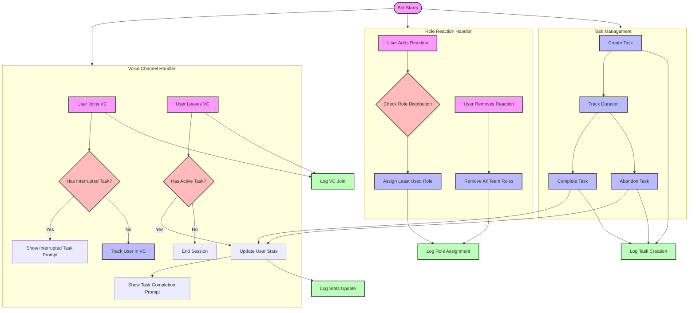

```mermaid
graph TD
    %% Main Bot Events
    Start([Bot Starts]) --> VoiceHandler
    Start --> RoleHandler
    Start --> TaskHandler

    %% Voice Channel Flow
    subgraph VoiceHandler[Voice Channel Handler]
        VCJoin[User Joins VC] --> CheckTask{Has Interrupted Task?}
        CheckTask -->|Yes| ShowInterrupted[Show Interrupted Task Prompt]
        CheckTask -->|No| TrackUser[Track User in VC]
        VCLeave[User Leaves VC] --> CheckActiveTask{Has Active Task?}
        CheckActiveTask -->|Yes| UpdateStats[Update User Stats]
        CheckActiveTask -->|No| EndSession[End Session]
        UpdateStats --> ShowCompletion[Show Task Completion Prompt]
    end

    %% Role Management Flow
    subgraph RoleHandler[Role Reaction Handler]
        ReactAdd[User Adds Reaction] --> CheckRole{Check Role Distribution}
        CheckRole --> AssignRole[Assign Least Used Role]
        ReactRemove[User Removes Reaction] --> RemoveRoles[Remove All Team Roles]
    end

    %% Task Management Flow
    subgraph TaskHandler[Task Management]
        CreateTask[Create Task] --> TrackDuration[Track Duration]
        TrackDuration --> CompleteTask[Complete Task]
        TrackDuration --> AbandonTask[Abandon Task]
        CompleteTask --> UpdateStats
        AbandonTask --> UpdateStats
    end

    %% Stats and Logging
    UpdateStats --> LogStats[Log Stats Update]
    AssignRole --> LogRole[Log Role Assignment]
    RemoveRoles --> LogRole
    VCJoin --> LogVC[Log VC Join]
    VCLeave --> LogVC
    CreateTask --> LogTask[Log Task Creation]
    CompleteTask --> LogTask
    AbandonTask --> LogTask

    %% Styling
    classDef event fill:#f9f,stroke:#333,stroke-width:2px
    classDef action fill:#bbf,stroke:#333,stroke-width:2px
    classDef decision fill:#fbb,stroke:#333,stroke-width:2px
    classDef logging fill:#bfb,stroke:#333,stroke-width:2px

    class Start,VCJoin,VCLeave,ReactAdd,ReactRemove event
    class TrackUser,AssignRole,RemoveRoles,CreateTask,TrackDuration,CompleteTask,AbandonTask action
    class CheckTask,CheckActiveTask,CheckRole decision
    class LogStats,LogRole,LogVC,LogTask logging
``` 